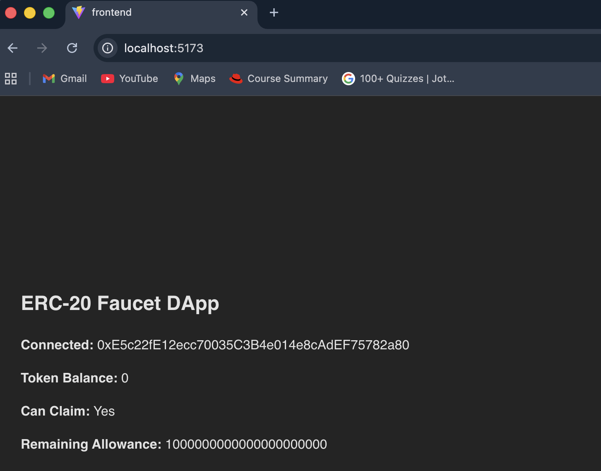
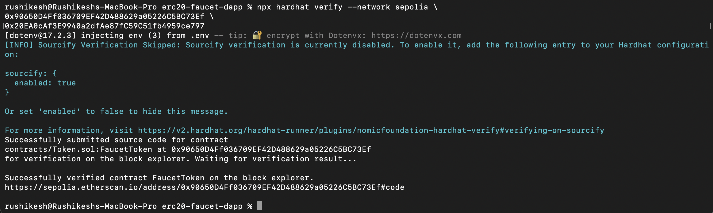
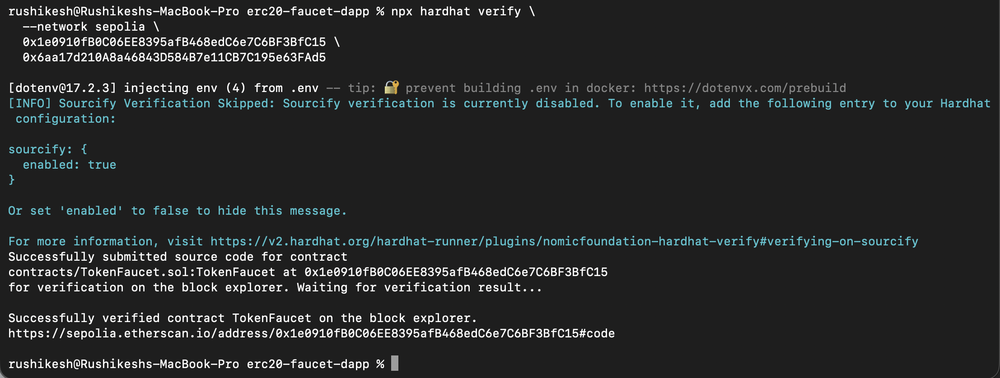
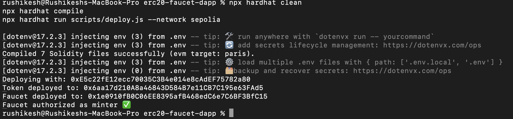
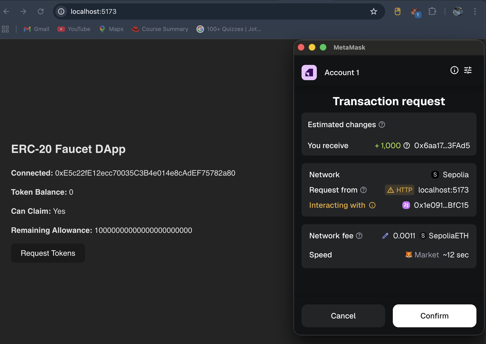
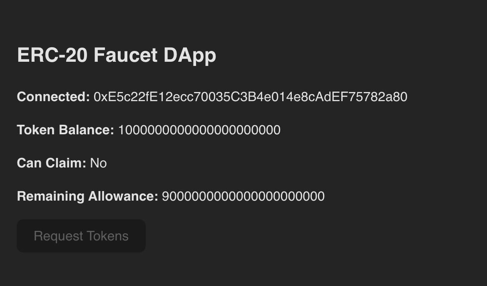
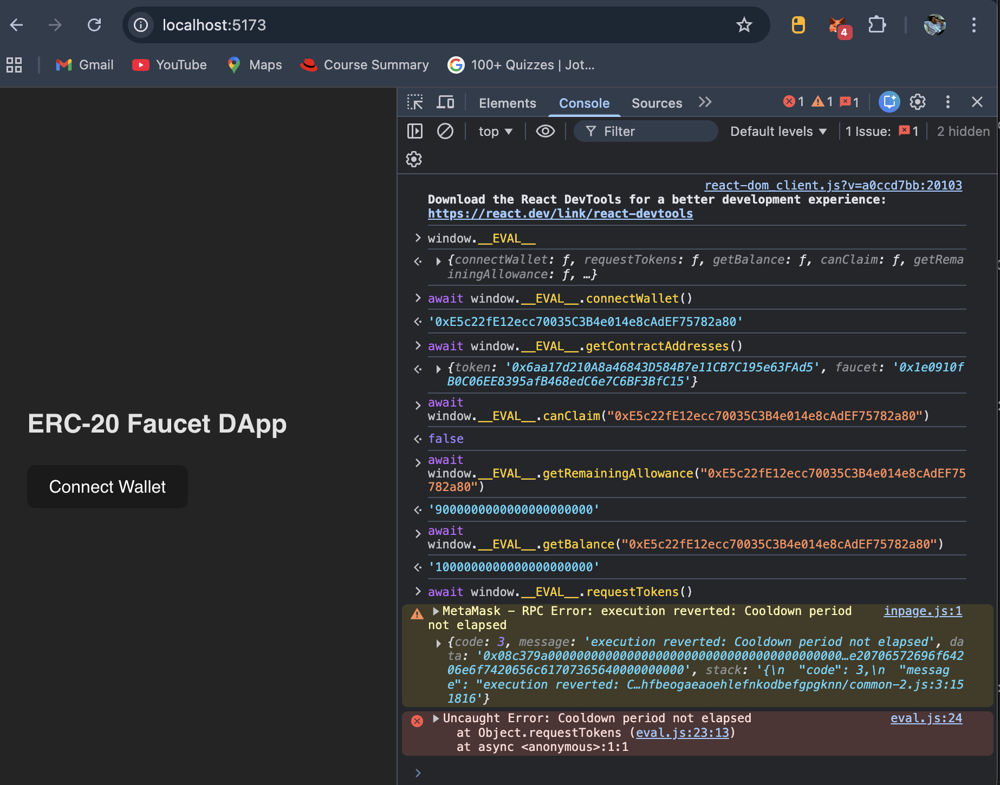
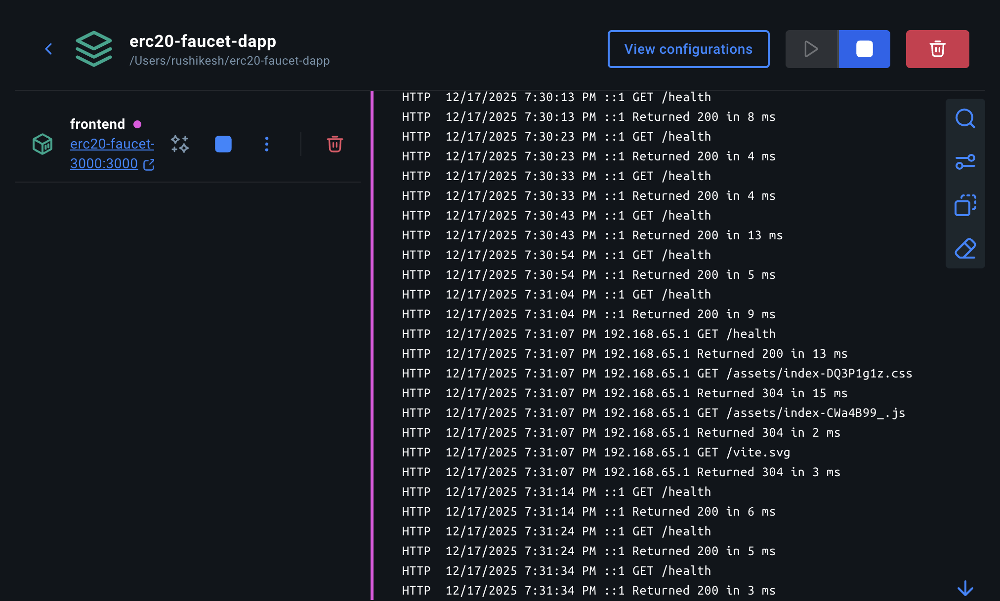
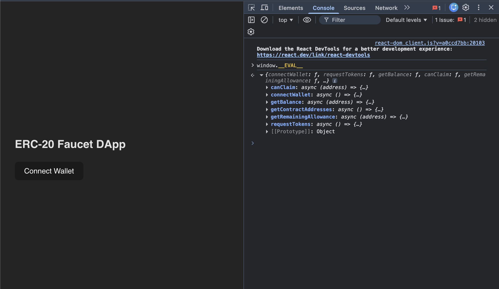

# ERC-20 Faucet DApp 

## Project Overview

This project is a complete **ERC-20 Faucet Decentralized Application (DApp)** built as part of a Web3 learning and evaluation task.  
The main goal of this project is to demonstrate **end-to-end Web3 development**, covering:

- Smart contract development
- On-chain access control & rate limiting
- Wallet integration (EIP-1193)
- Frontend ↔ Blockchain interaction
- Dockerized deployment
- Proper evaluation hooks (`window.__EVAL__`)

The faucet allows users to **claim a fixed amount of ERC-20 tokens**, with:
- A **24-hour cooldown** between claims
- A **lifetime claim limit**
- On-chain enforcement (no backend cheating)

Everything is deployed on **Sepolia testnet** and verified on **Etherscan**.

---

## Architecture Overview

**High-level flow:**

User Wallet (MetaMask)  
→ React Frontend (Vite + ethers.js)  
→ TokenFaucet Smart Contract  
→ ERC-20 Token Contract  
→ Blockchain (Sepolia)

Key points:
- Only the faucet contract can mint tokens
- Cooldown and limits are enforced on-chain
- Frontend only reads blockchain state, no trust assumptions

---

## Deployed Contracts (Sepolia)

> These are the FINAL deployed addresses used everywhere in this project.

- **ERC-20 Token Contract**  
  `0x6aa17d210A8a46843D584B7e11CB7C195e63FAd5`  
  https://sepolia.etherscan.io/address/0x6aa17d210A8a46843D584B7e11CB7C195e63FAd5

- **Faucet Contract**  
  `0x1e0910fB0C06EE8395afB468edC6e7C6BF3BfC15`  
  https://sepolia.etherscan.io/address/0x1e0910fB0C06EE8395afB468edC6e7C6BF3BfC15

Both contracts are **verified on Etherscan**.

---

## Smart Contract Features

### ERC-20 Token
- Fully ERC-20 compliant
- Fixed maximum supply
- Minting restricted only to Faucet contract
- Emits Transfer events correctly

### Faucet Contract
- Fixed token amount per claim
- 24-hour cooldown between claims
- Lifetime maximum claim limit per wallet
- Tracks:
  - `lastClaimAt(address)`
  - `totalClaimed(address)`
- Admin-controlled pause/unpause
- Clear revert messages for all failure cases

---

## Frontend Features

- Connect / disconnect wallet
- Displays connected address
- Shows real-time token balance
- Shows:
  - Can claim status
  - Remaining lifetime allowance
- Claim button disabled during cooldown
- Handles:
  - Cooldown errors
  - User rejection
  - Network errors
- Automatic UI updates after transaction confirmation

---

## Evaluation Interface (`window.__EVAL__`) 

The frontend exposes a global evaluation object used for automated testing.

Available functions:

```js
window.__EVAL__ = {
  connectWallet,
  requestTokens,
  getBalance,
  canClaim,
  getRemainingAllowance,
  getContractAddresses
}
```

### Function Details

- `connectWallet()` → returns connected address (string)
- `requestTokens()` → returns transaction hash (string)
- `getBalance(address)` → returns token balance (string)
- `canClaim(address)` → returns boolean
- `getRemainingAllowance(address)` → returns string
- `getContractAddresses()` → returns `{ token, faucet }`

All numeric values are returned as **strings**.

---

## Screenshots 📸

### 1. Wallet Connected


---

### 2. Token Contract Verified on Etherscan


---

### 3. Faucet Contract Verified on Etherscan


---

### 4. Successful Deployment


---

### 5. Request Tokens – MetaMask Popup


---

### 6. Token Claim Successful


---

### 7. Token Balance Updated


---

### 8. Cooldown Enforcement (Revert Error)


---

### 9. Evaluation Interface (`window.__EVAL__`)


---

### 10. Docker Health Check



Each screenshot is clearly named and referenced in this README.

---

## Docker Setup 

The application is fully Dockerized.

### Docker Image
```
rushi5706/erc20-faucet-dapp:latest
```

### Environment Variables

Create a `.env` file (or use `.env.example`):

```
VITE_RPC_URL=https://eth-sepolia.g.alchemy.com/v2/hejw0QbjGAV_0YqvM3Qr4
VITE_TOKEN_ADDRESS=0x6aa17d210A8a46843D584B7e11CB7C195e63FAd5
VITE_FAUCET_ADDRESS=0x1e0910fB0C06EE8395afB468edC6e7C6BF3BfC15
```

### Run Locally

```bash
docker compose up --build
```

Frontend will be available at:

```
http://localhost:3000
```

Health endpoint:

```
http://localhost:3000/health
```

---

## Project Structure

```
erc20-faucet-dapp/
├── contracts/
│   ├── Token.sol
│   ├── TokenFaucet.sol
│   └── test/
├── frontend/
│   ├── src/
│   │   ├── App.jsx
│   │   └── utils/
│   │       ├── contracts.js
│   │       └── eval.js
│   ├── Dockerfile
│   └── public/
├── scripts/
│   └── deploy.js
├── docker-compose.yml
├── hardhat.config.js
├── .env.example
└── README.md
```

---

## Testing & Validation

- Manual testing via MetaMask
- Console testing via `window.__EVAL__`
- Cooldown enforced correctly
- Lifetime limit enforced correctly
- Docker health check verified
- Contracts verified on Etherscan

---


